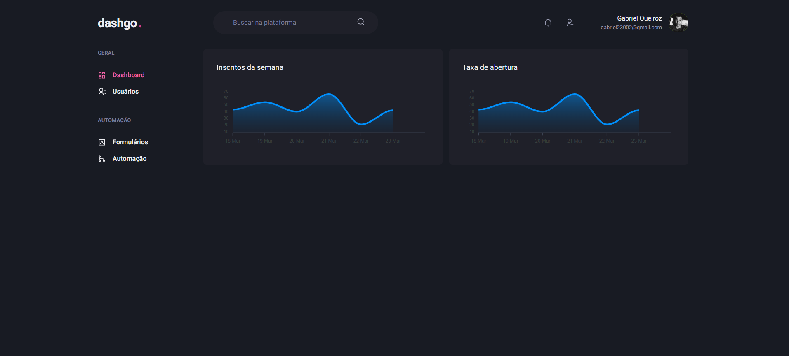

# dashgo
Next + Chakra UI - Projeto realizado no curso ignite trilha React - Rocketseat

# Para iniciar o projeto, instale as dependências

``
  yarn 
``

Ou
  

``
npm install
``

## Tela do Dashboard, onde foram usados gráficos com a biblioteca react-apexcharts

## Tela de usuários

## Tela de criação de usuários, onde foram utilzadas técnicas de validação com a biblioteca react-hook-form e YUP

